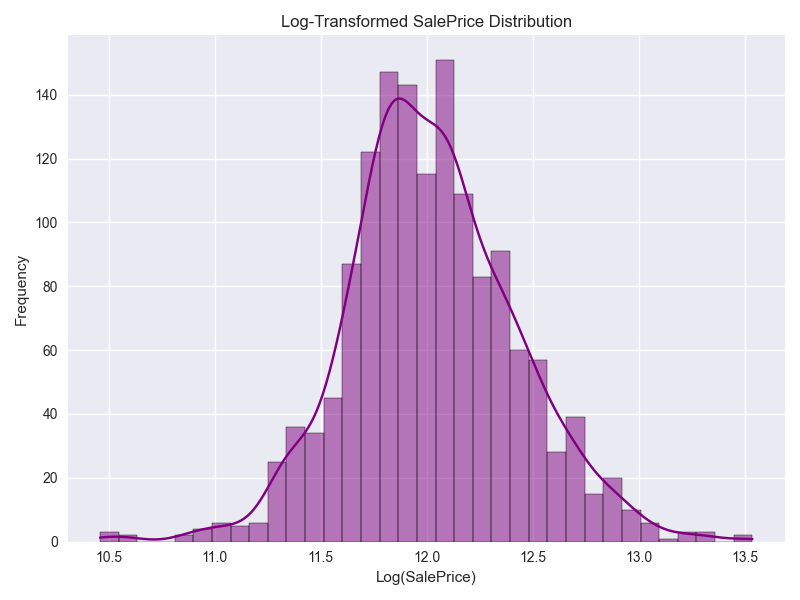
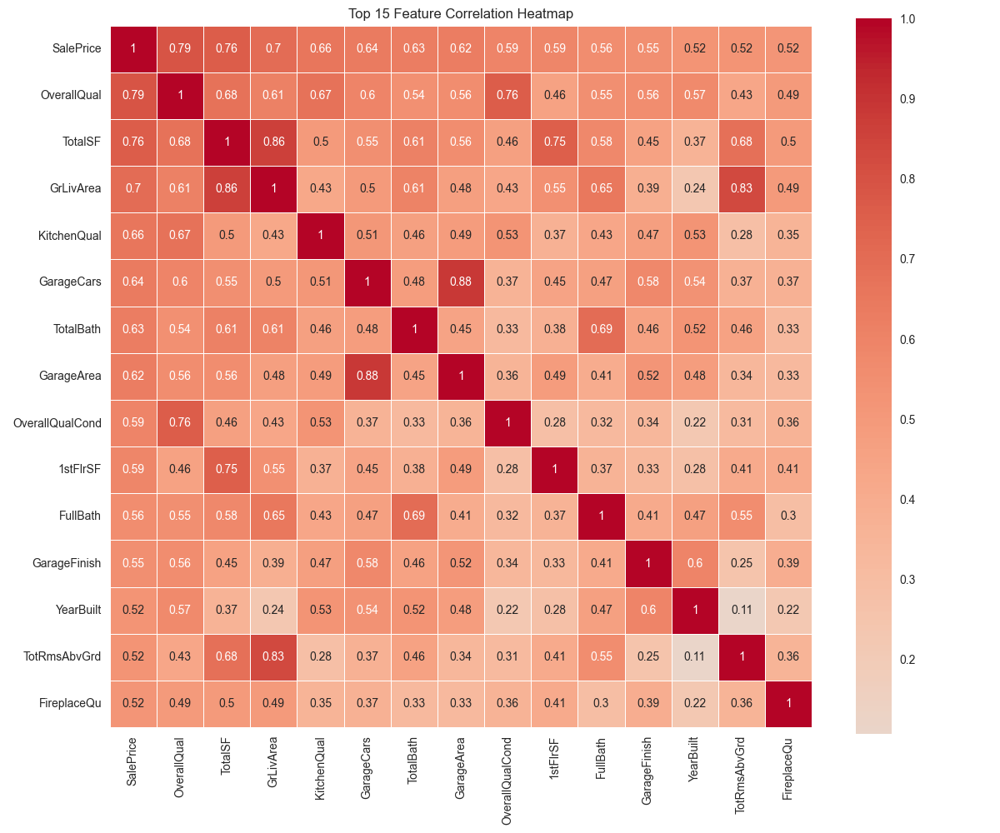
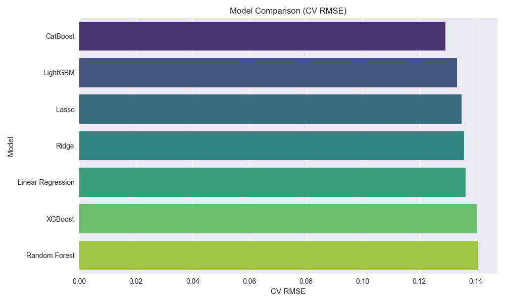
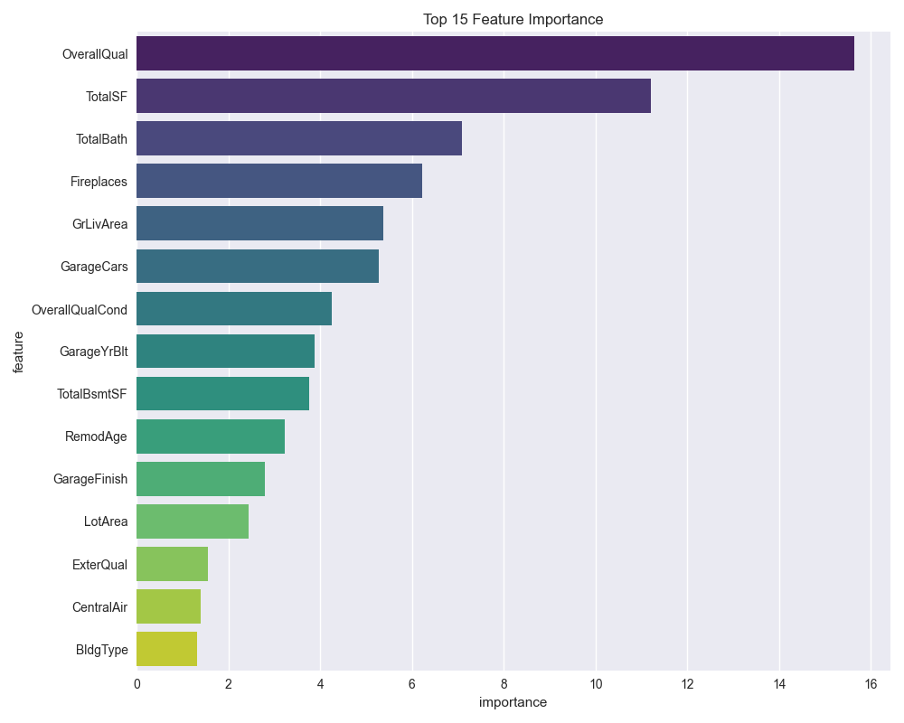

# House Price Prediction Project

A comprehensive machine learning pipeline for predicting house prices using the Kaggle "House Prices: Advanced Regression Techniques" dataset.

## 🎯 Project Overview

This project implements a complete end-to-end machine learning pipeline for predicting house sale prices. It includes data preprocessing, feature engineering, multiple model implementations, hyperparameter tuning, and generates submission-ready predictions.

## 📊 Dataset

**Source**: [Kaggle House Prices Competition](https://www.kaggle.com/competitions/house-prices-advanced-regression-techniques/data)

**Dataset Details**:
- **Training Data**: 1,460 samples with 79 features + target variable (SalePrice)
- **Test Data**: 1,459 samples with 79 features
- **Target Variable**: SalePrice (continuous)
- **Evaluation Metric**: Root Mean Squared Logarithmic Error (RMSLE)

## 🚀 Quick Start

### Prerequisites

```bash
pip install pandas numpy matplotlib seaborn scikit-learn xgboost lightgbm catboost scipy
```

### Required Files

Download the following files from Kaggle and place them in your project directory:
- `train.csv` - Training dataset
- `test.csv` - Test dataset
- `sample_submission.csv` - Sample submission format

### Running the Project

```bash
jupyter notebook house_price_reg.ipynb
```

## 📋 Project Structure

```
house-price-prediction/
│
├── house_price_reg.ipynb        # Main notebook
├── README.md                    # This file
├── train.csv                    # Training data (download from Kaggle)
├── test.csv                     # Test data (download from Kaggle)
├── sample_submission.csv        # Sample submission (download from Kaggle)
└── submission.csv               # Generated predictions (output)
```

## 🔧 Pipeline Components

### 1. Data Exploration & Analysis
- **Target Variable Analysis**: Distribution, skewness, and statistical summary
- **Missing Values Assessment**: Comprehensive analysis of missing data patterns
- **Feature Type Classification**: Identification of numeric and categorical features
- **Correlation Analysis**: Feature relationships and multicollinearity detection

### 2. Data Preprocessing
- **Intelligent Missing Value Imputation**:
  - Domain-knowledge based filling (e.g., 'None' for missing garage features)
  - Mode imputation for categorical variables
  - Median imputation for numeric variables
- **Outlier Detection**: Statistical outlier identification
- **Data Type Optimization**: Efficient memory usage

### 3. Feature Engineering
- **New Feature Creation**:
  - `TotalSF`: Total square footage (basement + 1st floor + 2nd floor)
  - `TotalBath`: Total bathrooms (full + half bathrooms)
  - `TotalPorchSF`: Total porch area
  - `HouseAge`: Age of the house when sold
  - `RemodAge`: Years since last remodeling
  - `GarageAge`: Age of the garage
  - `OverallQualCond`: Combined quality and condition score

- **Ordinal Encoding**: Converting quality ratings to numeric scales
- **Skewness Handling**: Log transformation for highly skewed features
- **Label Encoding**: Converting categorical variables to numeric

### 4. Model Implementation

#### Models Tested:
1. **Linear Regression**: Baseline linear model
2. **Ridge Regression**: L2 regularization
3. **Lasso Regression**: L1 regularization with feature selection
4. **Random Forest**: Ensemble of decision trees
5. **XGBoost**: Gradient boosting with advanced regularization
6. **LightGBM**: Fast gradient boosting framework
7. **CatBoost**: Gradient boosting with categorical feature support

#### Model Evaluation:
- **Cross-Validation**: 5-fold cross-validation for robust performance estimation
- **Metrics**: RMSE, MAE, R² score
- **Validation Strategy**: Hold-out validation set (20% of training data)

### 5. Hyperparameter Tuning
- **GridSearchCV**: Systematic hyperparameter optimization
- **Parameters Tuned**: Learning rate, max depth, n_estimators, subsample ratio
- **Best Model Selection**: Automated selection based on cross-validation performance

### 6. Model Interpretability
- **Feature Importance**: Identification of most influential features
- **Correlation Analysis**: Understanding feature relationships
- **Residual Analysis**: Model performance diagnostics

## 📈 Key Features

### Advanced Preprocessing
- **Smart Missing Value Handling**: Domain-specific imputation strategies
- **Feature Scaling**: RobustScaler for handling outliers
- **Skewness Correction**: Log transformation for normalized distributions

### Comprehensive Feature Engineering
- **Domain Knowledge Integration**: Real estate expertise in feature creation
- **Automated Feature Selection**: Correlation-based feature filtering
- **Ordinal Encoding**: Proper handling of ranked categorical variables

### Model Diversity
- **Linear Models**: Ridge, Lasso with regularization
- **Tree-Based Models**: Random Forest, XGBoost, LightGBM, CatBoost
- **Ensemble Methods**: Multiple model comparison and selection

### Robust Evaluation
- **Cross-Validation**: K-fold validation for reliable performance estimates
- **Multiple Metrics**: RMSE, MAE, R² for comprehensive evaluation
- **Residual Analysis**: Model diagnostic plots

## 📊 Visualizations

Below are a few key visualizations from the pipeline:

### 1. Log-Transformed Target Distribution


### 2. Top Feature Correlation Heatmap


### 3. Model Comparison (CV RMSE)


### 4. Feature Importance from Best Model


## 🎯 Model Performance

Typical performance metrics (may vary with different runs):

| Model         | Validation RMSE | Cross-Validation RMSE |
|---------------|------------------|------------------------|
| CatBoost      |    0.141526      |      0.129202          |
| LightGBM      |    0.138761      |      0.133419          |
| Lasso         |    0.138159      |      0.134987          |
| Ridge         |    0.144037      |      0.135780          |
| Linear Regr   |    0.145828      |      0.136318          |
| XGBoost       |    0.146726      |      0.140230          |
| Random Forest |    0.143620      |      0.140599          |


### Most Important Features:
1. **OverallQual**: Overall material and finish quality
2. **TotalSF**: Total square footage
3. **GrLivArea**: Above grade living area
4. **GarageCars**: Size of garage in car capacity
5. **TotalBath**: Total number of bathrooms

### Feature Engineering Impact:
- **TotalSF**: Combining basement, 1st, and 2nd floor areas improves prediction
- **TotalBath**: Aggregating all bathroom counts provides better signal
- **Age Features**: House age and remodeling age are strong predictors

